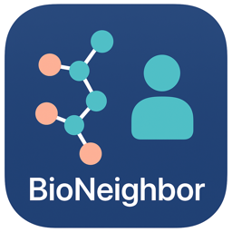
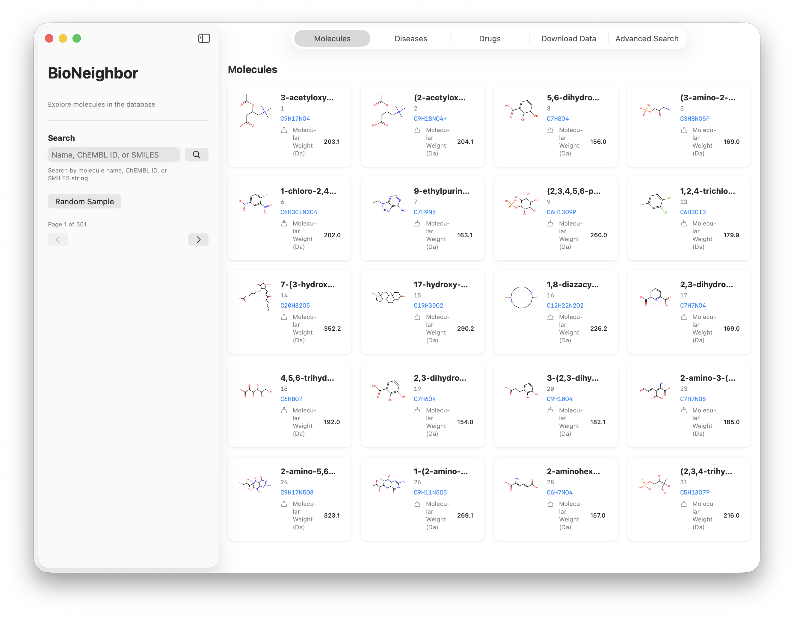
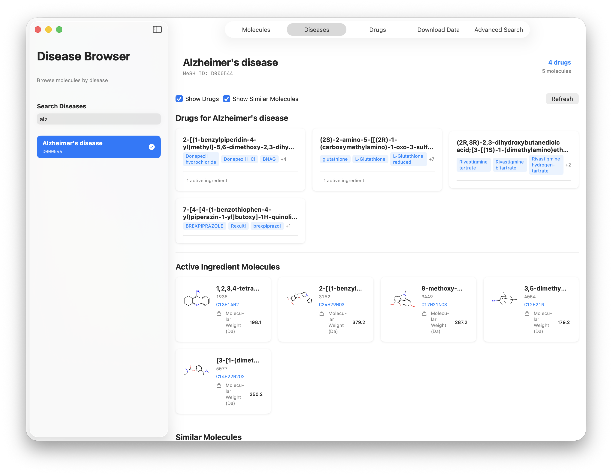
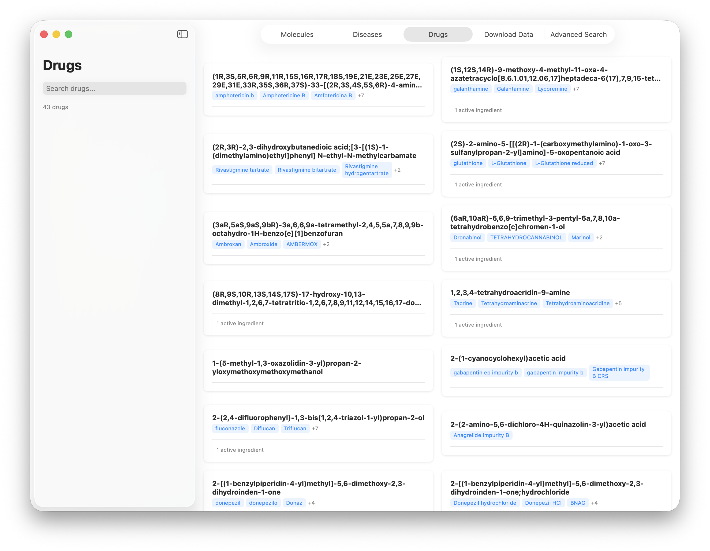
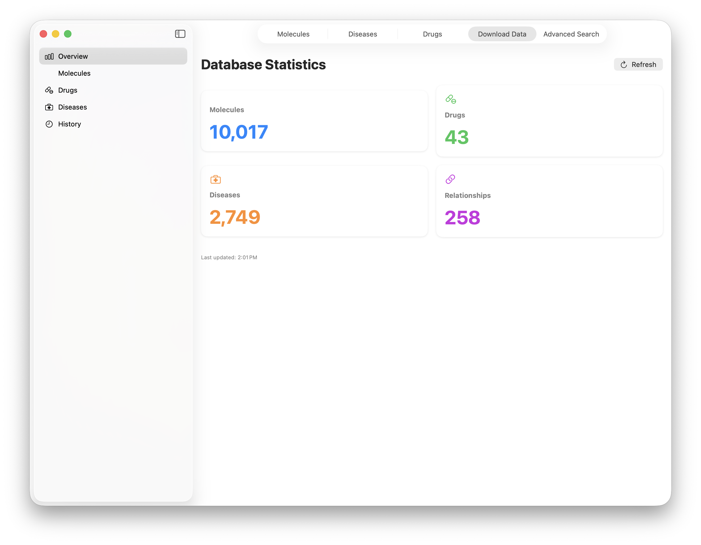
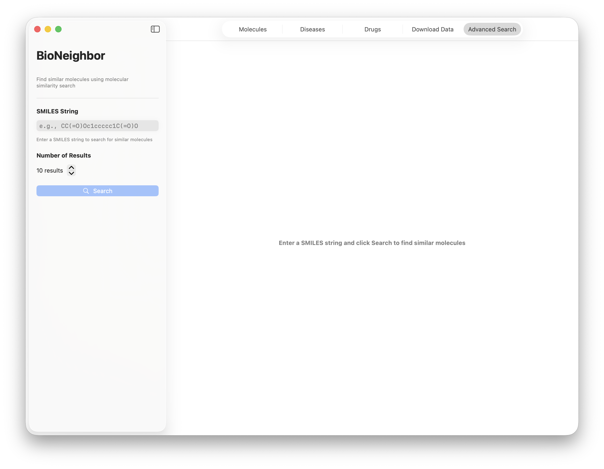
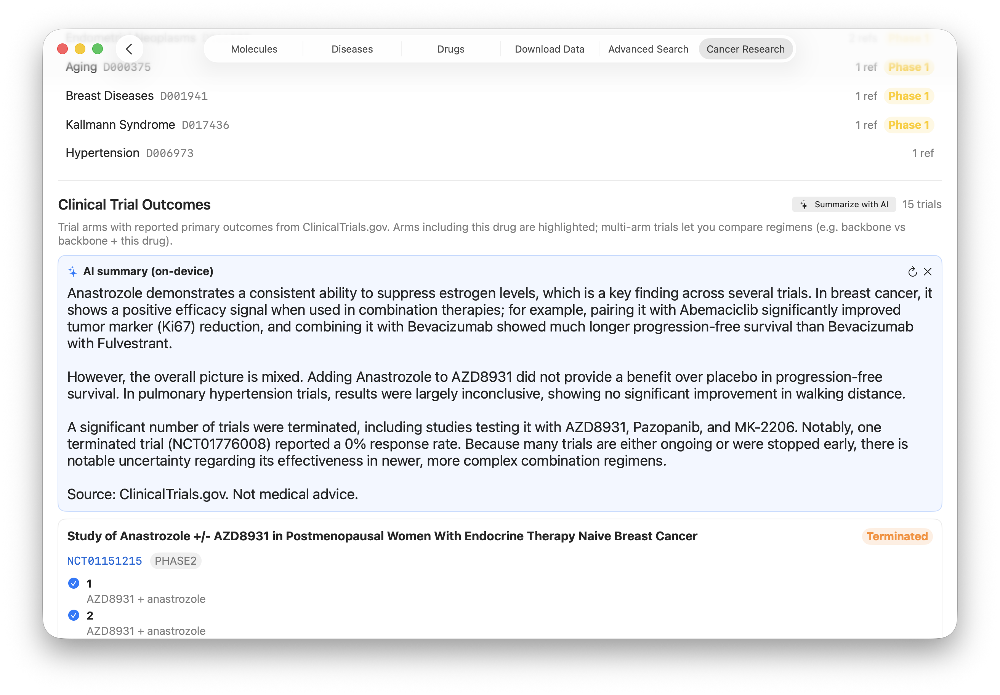
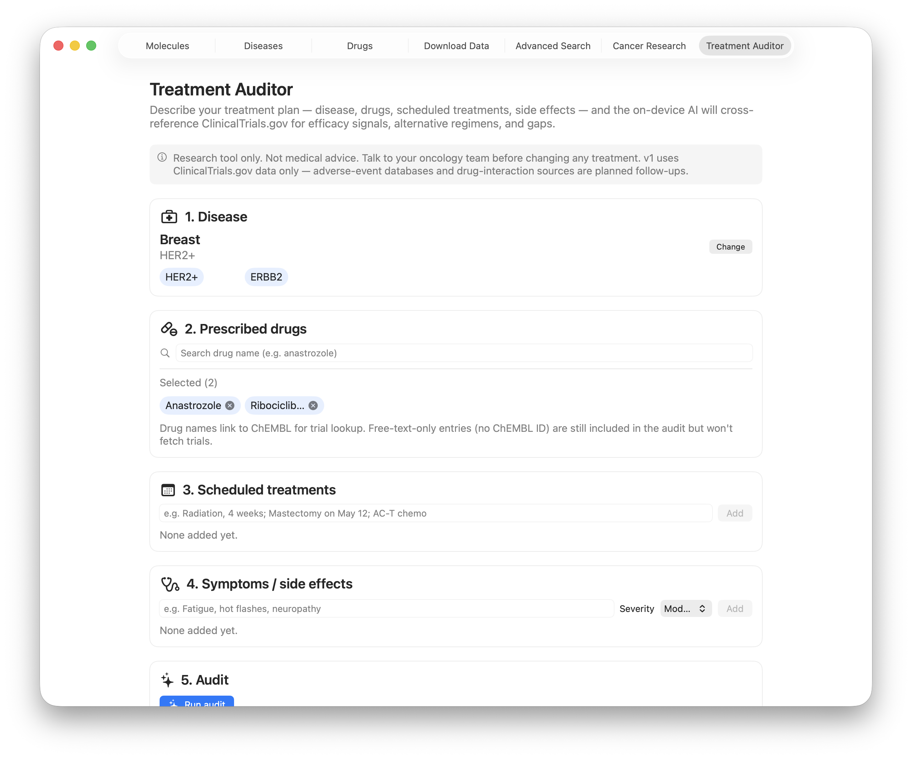
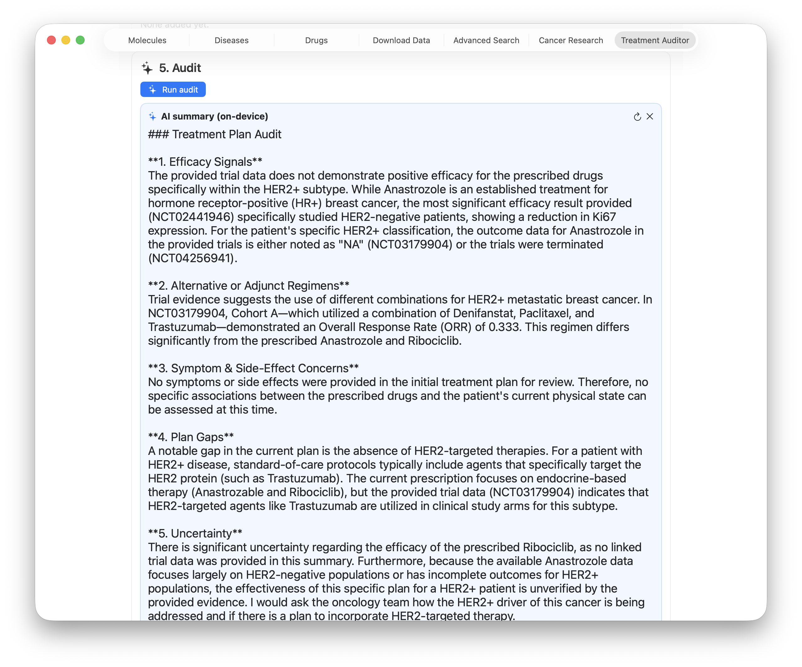

# BioNeighbor

<div align="center">
  
</div>

BioNeighbor: A molecular similarity engine inspired by collaborative filtering — find "neighbor" molecules to existing drugs and bioactive compounds.

**Discover structurally and functionally similar molecules to explore biochemical pathways and improve drug efficacy.**

---

## Overview

BioNeighbor is a molecular similarity and discovery platform inspired by **collaborative filtering (CF)**. Its goal is to help researchers, software engineers, and drug discovery enthusiasts explore “neighbor” molecules — compounds structurally or biologically similar to a molecule of interest.  

The system is designed to be **offline-friendly**, running entirely on a user’s Mac (or other desktop platform) without requiring a server. Users can pick an existing drug or bioactive compound and find similar molecules that might improve efficacy, target specific pathways, or serve as candidate inhibitors.  

BioNeighbor combines:
- Public biochemical datasets (ChEMBL, BindingDB)  
- Molecular fingerprints and embeddings (computed via RDKit or other cheminformatics tools)  
- Nearest-neighbor and similarity search engines (FAISS / vector search)  
- Optional collaborative filtering for hybrid recommendation of molecules  

---

## Key Features

- **Molecule-centric search:** Start with a known drug or bioactive compound and find similar molecules.  
- **Biological target awareness:** Incorporates pathway and protein target information (e.g., adenosine-related targets) when available.  
- **Offline operation:** No server required — the Python engine for molecular similarity runs locally, called from a Mac app or other front-end.  
- **Interactive visualization:** Molecule structures can be visualized in 2D or 3D using embedded viewers (e.g., 3Dmol.js, NGL Viewer, or SwiftUI wrapper).  
- **CF-inspired neighbor recommendations:** Uses the concept of collaborative filtering applied to molecules and their activity profiles to prioritize promising candidates.
- **Cancer Research workspace:** Drill into a cancer type, pick a drug, and see synonyms, indications, structurally similar drugs, and a unified Clinical Trial Outcomes section pulled from ClinicalTrials.gov — multi-arm trials, primary outcomes, per-arm values with 95% CIs, and CI-overlap flags so you can spot likely-real differences vs noise.
- **On-device AI trial summaries (optional):** Point the app at a local Ollama install and get a plain-English summary of every clinical trial listed for a drug. Runs entirely on your machine — no data leaves the device. Default model is `gemma4:26b`; configurable in Settings.
- **Treatment Auditor (multi-source deep audit):** Describe a cancer treatment plan — disease/subtype, **stage + free-text stage detail** (e.g. "metastasized to bone"), prescribed drugs, scheduled treatments, symptoms/side effects — and the on-device AI runs a multi-pass audit. Sources: NCI PDQ standard-of-care text from cancer.gov, ClinicalTrials.gov searches for radiation / surgery / chemotherapy / targeted-therapy trials in the subtype (independent of the patient's drugs), and per-drug trial outcomes. Each source gets its own streaming mini-summary; a final synthesis pass combines them with explicit "Further reading" citations to the PDQ URL and the most-relevant NCT IDs. Each step shows up as a progress row so the wait feels like work. Research tool only, not medical advice. Adverse-event databases, drug-interaction sources, and tumor-mutation matching are tracked as planned follow-ups.

---

## Screenshots


*Molecules tab - Browse and explore molecules in the database*


*Diseases tab - Browse diseases and their associated drugs and molecules*


*Drugs tab - View all drugs with detailed information*


*Download Data tab - Download molecules, drugs, and diseases with real-time progress tracking*


*Advanced Search tab - Search for similar molecules by SMILES or ChEMBL ID*


*Cancer Research tab - Drug detail with Clinical Trial Outcomes and an optional on-device AI summary (Ollama + Gemma 4) condensing every trial into a few paragraphs.*


*Treatment Auditor tab - Enter your cancer type/subtype, prescribed drugs (autocompleted against ChEMBL), scheduled treatments, and side effects. Research tool only, not medical advice.*


*Treatment Auditor - Streaming on-device AI audit covering efficacy signals, alternative regimens, side-effect concerns, plan gaps, and uncertainty, citing ClinicalTrials.gov NCT IDs.*

---

## Use Cases

- **Drug repurposing:** Discover alternative molecules similar to existing drugs to target new pathways.  
- **Adenosine pathway research:** Explore candidates that modulate adenosine production (e.g., CD73, CD39, A2A receptor inhibitors).  
- **Molecular discovery for other pathways:** Flexible framework supports any pathway or target with available activity data.  
- **Educational / research tool:** Provides an approachable interface for exploring chemical space and molecular similarity without needing deep ML expertise.  

---

## Architecture

BioNeighbor separates **frontend** and **backend logic** while remaining fully offline:

1. **Frontend:** SwiftUI macOS application  
   - Allows users to browse molecules, diseases, and drugs  
   - Search for similar molecules by SMILES or ChEMBL ID  
   - Visualizes molecules using embedded 2D/3D viewers  
   - Download data from multiple sources with real-time progress tracking  
   - Built with RxSwift for reactive programming patterns  

2. **Backend / local engine:** Python Flask API server with:  
   - RDKit for fingerprint and descriptor computation  
   - FAISS for nearest-neighbor vector search  
   - SQLite database for molecules, drugs, diseases, and relationships  
   - Multi-API integration (openFDA, ClinicalTrials.gov, PubChem, RxNorm, NLM)  
   - Real-time progress tracking for downloads  
   - Database schema management and migrations  

The frontend communicates with the local Python engine via:  
- HTTP REST API on `http://127.0.0.1:5000`  
- Automatic backend process management  

---

## Datasets

BioNeighbor supports multiple data sources with automatic fallback and comprehensive disease-drug relationships:

**Molecules:**
1. **PubChem FTP** (Primary - Recommended for bulk downloads)
   - Full SDF files via FTP (300-500 MB per file, ~500,000 compounds)
   - No API rate limits
   - URL: [PubChem FTP CURRENT-Full](https://ftp.ncbi.nlm.nih.gov/pubchem/Compound/CURRENT-Full/)
   - Automatically downloads, decompresses, and converts to SMILES

2. **PubChem API** (Fallback)
   - Individual molecule downloads by name or CID
   - Rate-limited but reliable for smaller batches
   - Automatic retry with exponential backoff

3. **ZINC Database** (Alternative)
   - Curated drug-like and lead-like subsets
   - Bulk SMILES file downloads
   - URL: [ZINC Database](https://zinc.docking.org/)

4. **ChEMBL** (Live)
   - Powers the Cancer Research tab end-to-end: live drug-name search with write-through caching, full drug detail (synonyms, indications, structure, similar drugs), approved-drug ingestion, and NCT lookup via `drug_indication`.
   - Accessed via `chembl_webresource_client` — the long-running 500-error outages tracked in [chembl/chembl_webresource_client#134](https://github.com/chembl/chembl_webresource_client/issues/134) have been resolved.
   - Calls run through a small thread-pool helper with hard timeouts (5–20 s depending on endpoint) so a slow ChEMBL response never hangs the UI.

**Drugs:**
- **RxNorm API** - Standardized drug names and ingredients (bulk downloads)
- **PubChem** - Comprehensive drug information (indications, MOA, ingredients)
- **openFDA** - FDA-approved drugs by condition
- **ClinicalTrials.gov** - Drugs in clinical trials

**Diseases:**
- **NLM Clinical Tables** - 2,400+ medical conditions with ICD codes and synonyms
  - Bulk download via JSON file: [ctss-downloads](https://clinicaltables.nlm.nih.gov/ctss-downloads/)
  - API access: [conditions v3 API docs](https://clinicaltables.nlm.nih.gov/apidoc/conditions/v3/doc.html)

**Data Download Priority:**
1. PubChem FTP (for bulk molecule downloads)
2. RxNorm + PubChem (for bulk drug downloads)
3. NLM Clinical Tables (for disease data)
4. PubChem API (for individual downloads)
5. ZINC database (alternative source)
6. Sample data (for testing)

Users can download data through the in-app interface with real-time progress tracking.

---

## CF Metaphor

BioNeighbor leverages a **collaborative filtering metaphor**:

- Molecules = “items”  
- Targets / pathways = “users”  
- Activity / binding data = “ratings”  

This analogy allows CF-inspired models to prioritize molecules based on structural similarity **and** shared biological activity.

---

## Getting Started

### Prerequisites

- **macOS** 13.0 or later
- **Python 3.9+** (Python 3.11 or 3.12 recommended)
  - Install via Homebrew: `brew install python3` or `brew install python@3.12`
  - Or use conda: `conda install python=3.11`
- **Xcode 14+** (for macOS app development)
- **Internet connection** (for initial dataset download)

### Quick Start

1. **Clone the repository:**
   ```bash
   git clone <repository-url>
   cd bio-neighbor
   ```

2. **Run the setup script:**
   ```bash
   ./setup.sh
   ```
   This will:
   - Create a Python virtual environment
   - Install all Python dependencies (RDKit, FAISS, etc.)
   - Create necessary directories
   
   **Note:** If RDKit installation fails via pip, you can use conda:
   ```bash
   conda install -c conda-forge rdkit
   ```
   Or see [INSTALL_RDKIT.md](INSTALL_RDKIT.md) for alternative installation methods.

3. **Activate the virtual environment:**
   ```bash
   source venv/bin/activate
   ```

4. **Initialize database schema (first time only):**
   ```bash
   python backend/db_migrations.py
   ```
   This will:
   - Create all database tables (molecules, diseases, drugs, etc.)
   - Set up indexes and foreign keys
   - Track schema version for future migrations
   
   **Note:** The schema is automatically initialized when running `setup` or download scripts, but you can run this manually to ensure the database is ready.

5. **Set up the data and build the search index:**
   ```bash
   python backend/main.py setup --max-molecules 10000
   ```
   This will:
   - **Automatically download from ZINC database** (recommended - no API limits)
   - Falls back to PubChem, ChEMBL, or sample data if needed
   - Compute molecular fingerprints using RDKit
   - Build the FAISS similarity search index
   - Automatically run database migrations if needed
   
   **Note:** For 10,000+ molecules, ZINC database is recommended. If automatic download fails, see [DOWNLOAD_DATA.md](DOWNLOAD_DATA.md) for manual download instructions.

6. **Test the backend (optional):**
   ```bash
   # Search for molecules similar to aspirin
   python backend/main.py search "CC(=O)Oc1ccccc1C(=O)O" --top-k 5
   
   # Start the API server
   python backend/api.py --mode http
   ```

7. **Build and run the macOS app:**
   - Open Xcode
   - Create a new macOS App project in `macos_app/` directory
   - Add all Swift files from `macos_app/BioNeighbor/`
   - Build and run (⌘R)
   - The app will automatically start the backend if needed

### Optional: On-device AI summaries for clinical trials

The Cancer Research tab can summarize every clinical trial listed for a drug into a short, plain-English paragraph. Inference happens locally via [Ollama](https://ollama.com), so trial data never leaves your machine.

1. **Install Ollama 0.20+** (`brew install ollama`, or download from [ollama.com](https://ollama.com)) and run `ollama serve` in a terminal.
2. **Pull a Gemma 4 model.** On a 16 GB Mac use `ollama pull gemma4` (≈9.6 GB E4B). On a 32 GB+ Mac use `ollama pull gemma4:26b` (≈18 GB MoE) for noticeably better summaries.
3. **Enable the feature in BioNeighbor.** Open the app, go to **BioNeighbor → Settings → AI Assistant (Ollama)**, flip on *Enable on-device AI summaries*, set the model name (default `gemma4:26b`), and click *Test connection*.
4. **Use it.** In the Cancer Research tab, open a drug with clinical trials and click the **✨ Summarize with AI** button next to the trials count. Output is summary-only — never medical advice — and is derived from the same ClinicalTrials.gov data already shown on the page.

### Backend API

The backend provides a comprehensive REST API on `http://127.0.0.1:5000`:

**Search & Discovery:**
- `POST /search` - Search for similar molecules by SMILES string
- `POST /search/chembl` - Search by ChEMBL ID
- `POST /search/by-disease` - Search similar molecules to disease-related drugs
- `GET /search/molecules` - Autocomplete search for molecules
- `GET /search/drugs` - Autocomplete search for drugs
- `GET /search/diseases` - Autocomplete search for diseases

**Molecules:**
- `GET /molecules` - List molecules with pagination and search
- `GET /molecule/<index>` - Get molecule by index
- `GET /molecule/<index>/thumbnail` - Get molecule thumbnail image
- `GET /molecule/<index>/3d` - Get 3D coordinates for molecule
- `POST /render` - Render molecule structure image

**Diseases:**
- `GET /diseases` - List all diseases
- `GET /diseases/<name>/molecules` - Get molecules for a disease
- `GET /diseases/<name>/drugs` - Get drugs for a disease
- `GET /diseases/<name>/top-molecules` - Get top molecules for a disease

**Drugs:**
- `GET /drugs` - List all drugs
- `GET /drugs/<drug_id>` - Get drug by ID
- `GET /drugs/<drug_id>/molecules` - Get active ingredient molecules for a drug

**Data Downloads:**
- `POST /download/molecules` - Download molecules (by count, name, or full SDF file)
- `POST /download/drugs` - Download drugs (by name, disease, or bulk)
- `POST /download/diseases` - Download diseases (by name or bulk from NLM)
- `GET /download/status/<task_id>` - Get download progress status

**Statistics:**
- `GET /stats` - Get database statistics (molecules, drugs, diseases, relationships)
- `GET /health` - Health check

### Command Line Interface

The backend also provides a CLI for testing:

```bash
# Setup data and index
python backend/main.py setup --max-molecules 10000

# Search by SMILES
python backend/main.py search "CC(=O)Oc1ccccc1C(=O)O" --top-k 10

# Search by ChEMBL ID
python backend/main.py search-chembl CHEMBL25 --top-k 5
```

### Database Schema Management

The database schema is managed through a migration system:

- **`backend/db_schema.py`**: Defines all table structures
- **`backend/db_migrations.py`**: Handles schema migrations and versioning
- **`backend/SCHEMA.md`**: Complete schema documentation

**Running migrations:**
```bash
# Check current schema version
python backend/db_migrations.py --check

# Run migrations (automatic - run this if you get schema errors)
python backend/db_migrations.py

# Force recreate all tables (DANGEROUS - deletes all data!)
python backend/db_migrations.py --force-recreate
```

Migrations run automatically when:
- Running `python backend/main.py setup`
- Running any download script (molecules, drugs, diseases)
- Starting the API server

See [backend/SCHEMA.md](backend/SCHEMA.md) for complete schema documentation.

### Project Structure

```text
bio-neighbor/
├── backend/                      # Python backend
│   ├── api.py                    # Flask HTTP API server
│   ├── main.py                   # CLI entry point
│   ├── search_engine.py          # Similarity search engine
│   ├── data_loader.py            # Dataset loading utilities
│   ├── fingerprints.py           # Molecular fingerprint computation
│   ├── index_builder.py          # FAISS index building
│   ├── molecule_renderer.py      # 2D structure rendering
│   ├── db_schema.py              # Database schema definitions
│   ├── db_migrations.py          # Schema migration system
│   ├── download_molecules.py     # Molecule download scripts
│   ├── download_drugs_*.py       # Drug download scripts (RxNorm, bulk)
│   ├── download_diseases_nlm.py  # Disease download from NLM
│   ├── download_by_name.py       # Download by name (molecules/drugs/diseases)
│   ├── multi_api_disease_loader.py # Multi-API drug search
│   ├── progress_tracker.py        # Real-time progress tracking
│   ├── stream_process_output.py   # Subprocess output streaming
│   └── test_*.py                 # Test suites
├── macos_app/                    # SwiftUI macOS app
│   └── BioNeighbor/
│       └── BioNeighbor/
│           ├── BioNeighborApp.swift  # Main app entry point
│           ├── BackendService.swift  # Python backend service integration
│           ├── OllamaService.swift    # Local Ollama client (AI trial summaries)
│           ├── BrowseView.swift      # Molecules tab
│           ├── DiseaseBrowseView.swift # Diseases tab
│           ├── DiseasesDownloadView.swift # Disease download view
│           ├── DiseasesDownloadViewRx.swift # Disease download (RxSwift)
│           ├── DownloadStatisticsView.swift # Download statistics
│           ├── DrugCard.swift        # Drug card component
│           ├── DrugDataDownloadView.swift # Download Data tab
│           ├── DrugDetailView.swift  # Drug detail view
│           ├── DrugsView.swift       # Drugs tab
│           ├── DrugsDownloadView.swift # Drug download view
│           ├── DrugsDownloadViewRx.swift # Drug download (RxSwift)
│           ├── Models.swift          # Data models
│           ├── Molecule3DView.swift  # 3D molecule visualization
│           ├── MoleculeCard.swift    # Molecule card component
│           ├── MoleculeDetailView.swift # Molecule detail view
│           ├── MoleculesDownloadView.swift # Molecule download view
│           ├── MoleculesDownloadViewRx.swift # Molecule download (RxSwift)
│           ├── ReactiveDownloadService.swift # RxSwift download service
│           ├── ResultsView.swift     # Search results view
│           ├── SearchView.swift      # Advanced Search tab
│           └── TreatmentAuditorView.swift # Treatment Auditor tab
├── data/                         # Data files
│   ├── molecules.db              # SQLite database
│   ├── faiss_index.bin           # FAISS search index
│   ├── fingerprints.pkl         # Molecular fingerprints
│   └── progress/                 # Progress tracking files
├── images/                       # Screenshots
├── venv/                         # Python virtual environment
├── setup.sh                      # Setup script
└── README.md                     # This file
```

---

## Naming

The project name **BioNeighbor** reflects its CF-inspired approach:  
> “Find the biological neighbors of a molecule in chemical and activity space.”

---

## Features

- **Real-time Progress Tracking:** See exactly what's happening during downloads with detailed progress information
- **Multi-API Integration:** Automatically searches multiple APIs (openFDA, ClinicalTrials.gov, PubChem, RxNorm) for comprehensive drug discovery
- **Database Schema Management:** Versioned schema with automatic migrations
- **Reactive Programming:** Built with RxSwift for responsive, asynchronous operations
- **Comprehensive Testing:** Unit tests, UI tests, and integration tests
- **Bulk Downloads:** Download entire datasets (molecules, drugs, diseases) with progress tracking
- **Offline Operation:** All data stored locally in SQLite database

## Future Work

- Optional training of collaborative filtering models locally  
- Enhanced visualization of molecular clusters and pathways  
- Additional dataset integrations  
- Performance optimizations for large-scale searches  

---

## License

- Core code: MIT
- Datasets: Check individual dataset licenses (ChEMBL, BindingDB, PubChem).